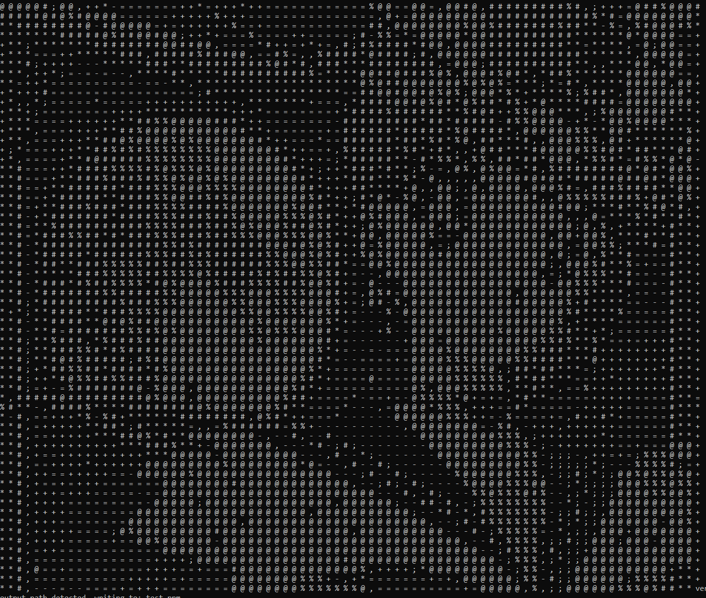
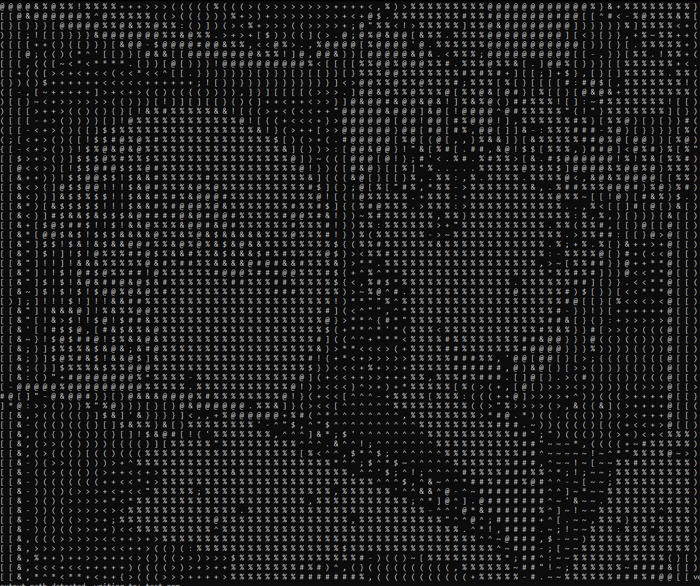
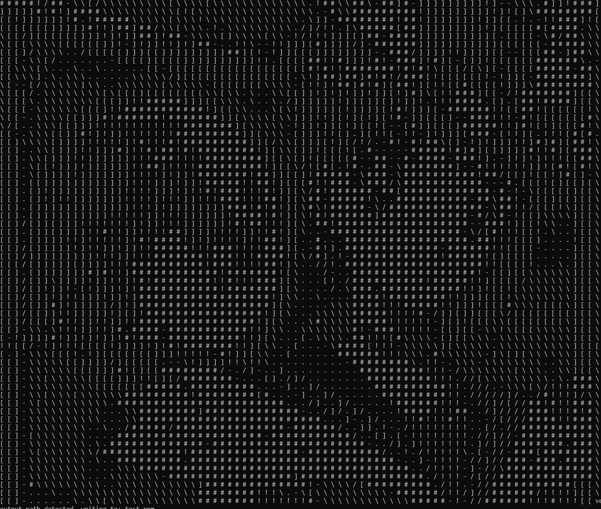
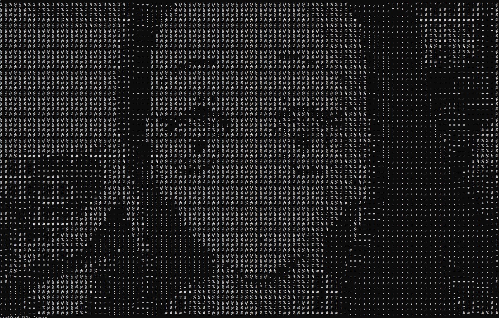
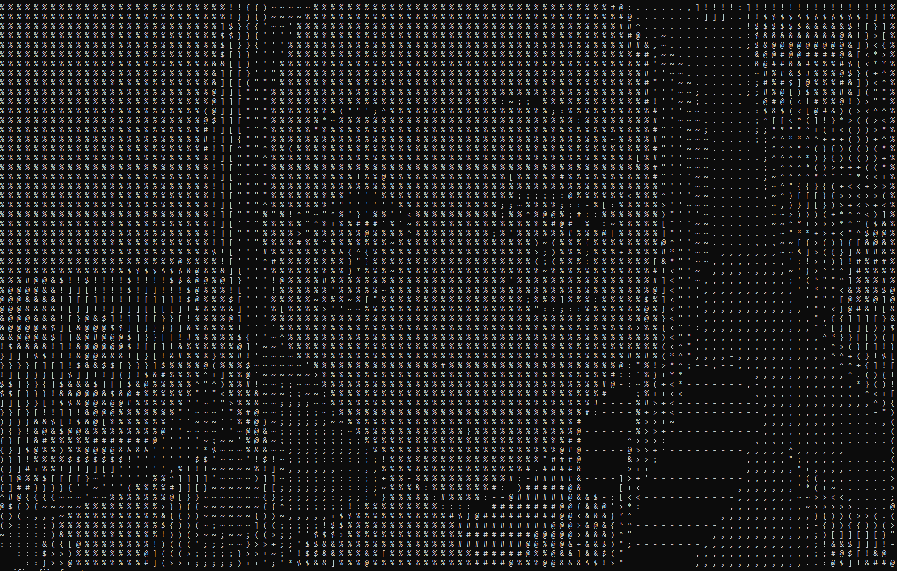
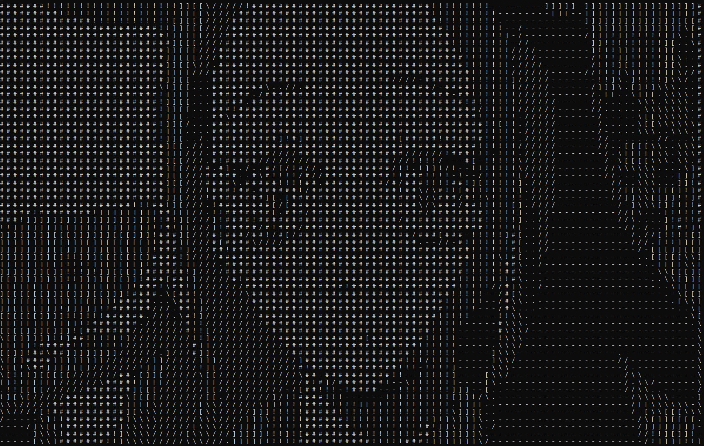

# CmdImg
A simple command line tool to create ascii art of any given image in PPM3 format. 

 

windows command prompt text size: 7 <br> original image size: 1400 X 1050 <br>
command: 

```
.\main.exe -i sailor_moon.ppm -o test.ppm -cw 160 -m 4
```

# PPM3 
PPM3 is a human readable image format consisting of header and pixel data as `RGB` values 
like: <br><br>
```
P3 
[width] 
[height] 
RGB
255 0 143
...
```
for more check <a href = "https://en.wikipedia.org/wiki/Netpbm">Netpbm on wikipedia</a>

# CmdImg: features
- The tool uses PPM3 data to modify and apply different effects to approach desired image properties, then turn that data to `ASCII` style art.
- Images are downscalable to desired console size (not upscalable).
- Works on most of console sizes but as `font-size` increases quality degrade. Lesser the `font-size` better the image translation to `ASCII`.
- Various modes of `ASCII` styles.
# Commands and Usage

| Commands | Usage |
|----------|-------|
| `-i` or `-input` | input image  e.g. -i test_image_1.ppm|
| `-o` or `-output` | output image e.g. -o output.ppm |
| `-ot` or `-out_txt` | output the ascii values generated to a given path e.g -ot out.txt|
| `-m` or `-mode` | ascii mode / style, available modes: <ul><li> [-m 0] ascii_gradient1<li>[-m `1`] ascii_gradient2</li><li>[-m `2`] box_gradient1</li><li>[-m `3`] box_gradient2</li><li>[-m `4`] visual_density</li><li>[-m `5`] subpixel   </li>       <li>[-m `6`] subpixel_black_shadows </li><li>[-m `7`] subpixel_green_black</li>    <li> e.g. -m 3</li> </ul> |
| `-lnm` or `-load_new_mode` | can load custom ascii gradients from a .txt file. <br> <ul> <li> the file should be of the form: <br> `gradient_name = [gradient]` <br> example: `my_mode = ';!@ ` </li> </ul> <br> Example: `-lnm my_mode.txt` |
| `-ch` or `-console_height` | images are larger than console, automatic scaling_factor calculation form console height. e.g. -ch 40     |  
| `-cw` or `-console_height` | images are larger than console, automatic scaling_factor calculation form form console width   e.g. -cw 40     |    
| `-d` or `-downscale_factor` | images are larger than console, manual scaling_factor input e.g. -d 4 |
| `-na` or `-no_ascii` | if don`t want to print image as ascii |
| `-h` or `-help` | provide all commands and instructions|


## Usage
<!-- <table>
<tr>
<td> -->

compile the `main.cpp` file and open `command prompt` and enter 

``` 
.\main.exe -i [input image].ppm 
``` 

it is enough to run the tool but it may ask you the details after some steps and for that you can add multiple commands like:

```
.\main.exe -i [input image].ppm -o [output].ppm -m 2 -ch 40
``` 

or if don't want to generate the ascii art

```
.\main.exe -i [input image].ppm -o [output].ppm -m 2 -ch 40 -no_ascii
```

<!-- </td>
</tr>
</table> -->

# Custom Modes 
the `-lnm` command offers users to create custom modes or gradients for their ascii.
to do so first you should have a `.txt` file of the format:
```
gradient1 = `'.,:;+=@#
gradient2 = ,.()[]{}
...
```
it is necessary that user don't leave the file empty or else an error might appear.

and to load the file in program simply use:
```
.\main.exe -i [input].ppm -lnm my_mode.txt
```


# Examples

<table>
<tr>
<td>

</td>
<td>

</td>
<td>

</td>
</tr>

<tr>
<td>
<center> 

    text size: 10, mode: 4 

</center>
</td>
<td>
<center> 

    text size: 10, mode: 0 

</center>
</td>
<td>
<center> 

    text size: 10, mode: 3 

</center>
</td>
</tr>

<tr>
<td>

</td>
<td>

</td>
<td>

</td>
</tr>

<tr>
<td>
<center>

    text size: 10, mode: 4

</center>
</td>
<td>
<center>

    text size: 10, mode: 0

</center>
</td>
<td>
<center>

    text size: 10, mode: 3

</center>
</td>
</tr>
</table>


